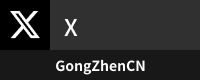

<h1 align="center">
    
</h1>

    <h2>👋 Hi, I'm Ckize</h2>
    
🎓 Senior High | 💻 Front-End Developer | 🎮 Gamer | 🌸 ACG Fan

    

    <h2>Stats</h2>
    

        <picture>
            
        </picture>
        <picture>
            
        </picture>
    

    

    <h2>Social Media</h2>
    

        
        
        
        
        
    

